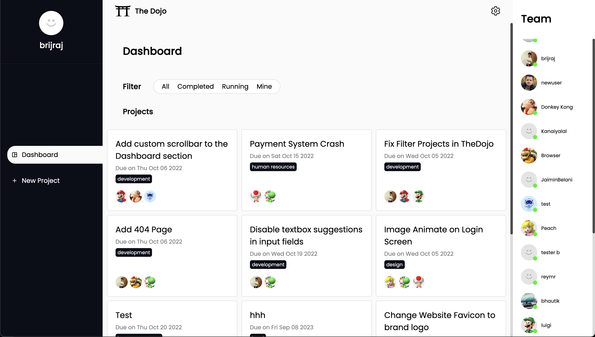
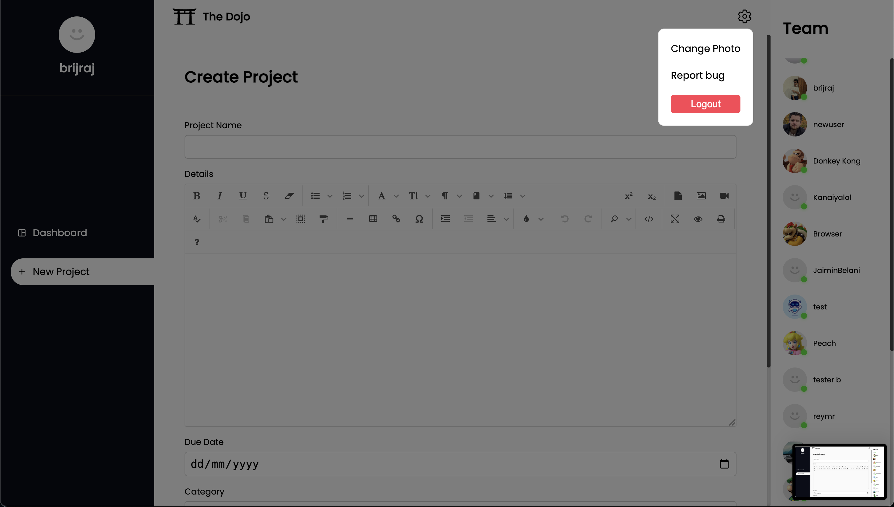

# 🥋 The Dojo - Project Management Mastery



## Overview

The Dojo is a modern, intuitive project management platform that helps teams collaborate, track progress, and achieve their goals with style. Built with React and Firebase, it combines powerful functionality with a beautiful user interface.

## ✨ Features

- 📊 Interactive Dashboard
- 🎯 Project Creation & Management
- 👥 Team Collaboration
- ⚙️ Customizable Settings
- 📝 Rich Text Editor
- 🖼️ Image Upload & Compression

## 🚀 Tech Stack

- React 18
- Firebase
- Framer Motion
- React Router
- Vite
- React Icons

## 🎨 Screenshots




## 🛠️ Getting Started

1. Clone the repository
2. Install dependencies:
   ```bash
   npm install
   ```
3. Start the development server:
   ```bash
   npm run dev
   ```

## 📝 License

MIT License - feel free to use this project for your own purposes!

---

Built with ❤️ by [Your Name]
